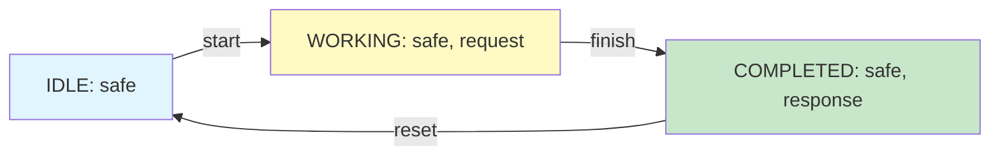

# GenPark Modal Temporal LTL Model Checker Skill

Linear Temporal Logic (LTL) symbolic model checker verifying Safety (G), Liveness (F), and Response properties.

Find more agent tools at [GenPark](https://genpark.ai) and the [GenPark MCP Catalog](https://genpark.ai/mcp).

## Features
- Kripke state transition graph construction.
- Verification of safety invariants with counterexample path generation.
- Zero external dependencies.
